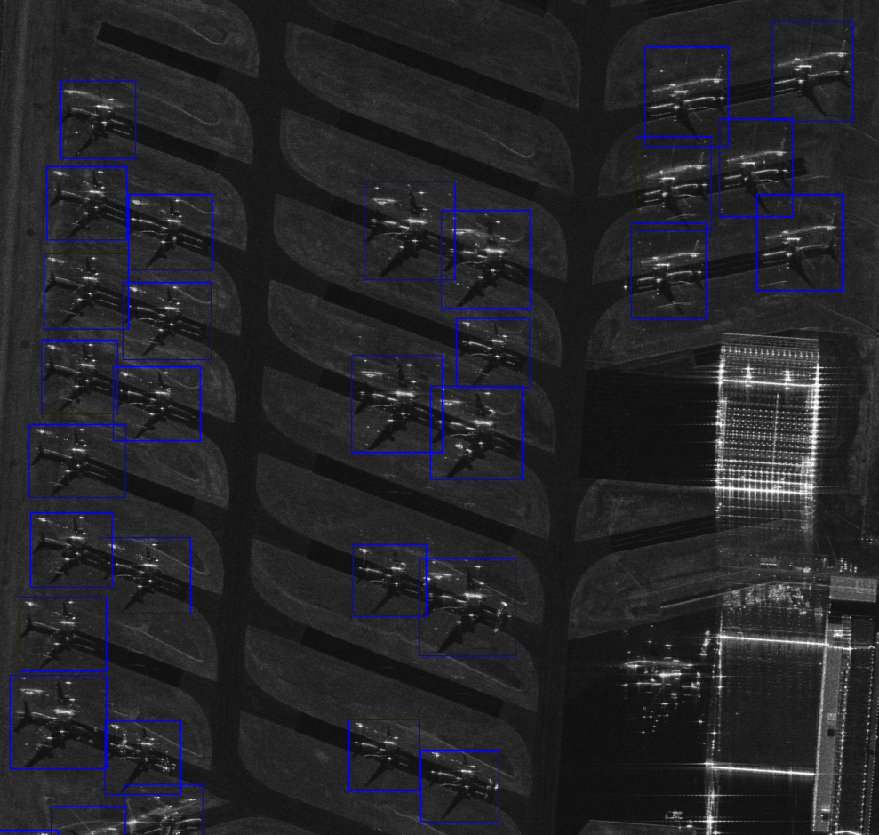

# Master-s-Thesis

This Master’s thesis tackles object detection in ultra‑high‑resolution SAR imagery from ICEYE, focusing on aircraft in complex airport scenes. A preprocessing pipeline for GRD and CSI products was implemented. A YOLOv8 CNN is adapted for detection and benchmarked against Vision Transformers and foundation models. Comparative experiments explore spatial resolutions (0.25–0.5 m), data formats, and model complexities, assessing recall, precision, and computational trade‑offs.

# Object Detection in Ultra-High Resolution Satellite SAR Data

**Master’s Thesis – Cristian Andreoli**  
University of Pavia – Dept. of Industrial and Information Engineering

Industrial Internship: ICEYE (Finland)

---

## Overview

This repository presents the data pipeline, and results of my Master’s Thesis, focusing on automatic object (aircraft) detection in ultra-high-resolution Synthetic Aperture Radar (SAR) imagery acquired from ICEYE satellites.

The project explored how state-of-the-art deep learning models, originally trained on optical images, can be adapted for the unique challenges of SAR data, including side-looking geometry, speckle noise, and double-bounce phenomena.

## Highlights

- **Custom SAR Dataset:** 2,019 aircraft annotated across 37 ICEYE SAR scenes (multiple acquisition modes: Dwell, Dwell Fine, Spot Fine).
- **Advanced Preprocessing:** Calibration, conversion to GRD and CSI, down/up-sampling, and intelligent tiling for optimal training and evaluation.
- **Modeling:** 
  - Fine-tuned YOLOv8 (CNN-based, pretrained on COCO) for robust, near real-time detection on SAR.
  - Vision Transformer foundation model for Earth Observation (Clay) adapted and fine-tuned for object detection task.
  - Ablation and benchmarking of ResNet50-based backbone for comparison.
- **Key Findings:**
  - YOLOv8 successfully transfers to SAR imagery with suitable fine-tuning and augmentation.
  - No significant detection benefit from CSI (colorized) vs. GRD (amplitude) images.
  - The careful choice of resolution (resizing) and tile size further improved localization, confirming that hyperparameter tuning is crucial for small-object detection. 
- **Research Impact:** The thesis demonstrates the practical effectiveness and limits of current deep learning architectures for small object detection in complex radar imagery, providing benchmarks for both academic and industrial Earth observation communities.

---

## Sample Images

### Example SAR Scene (GRD)

### Aircraft Annotation Example

### YOLOv8 Detection Output

---

## Structure

- `src/` — Model training and evaluation scripts (YOLO, Clay, ResNet50)
- `data/` — Processed SAR image samples, annotation files
- `notebooks/` — Data exploration and analysis notebooks
- `results/` — Output metrics, detection visualizations

---

## Publications & Links

- [Project page – Computer Vision Lab, UniPV](https://vision.unipv.it/research/ComputerVision/Fall-detection.html)
- [ICEYE](https://www.iceye.com/)
- For additional reading, see:
  - Andreoli, C. “Object Detection in Ultra-High Resolution Satellite SAR Data via Adaptation of a YOLO Model” (2025).

---

## How to Run

*(To be completed with instructions for environment setup, data download, and running the main scripts)*

---

## Acknowledgements

Supervised by Prof. Fabio Dell’Acqua (UniPV) and the ICEYE R&D team.

---

